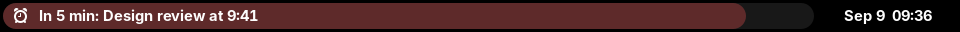
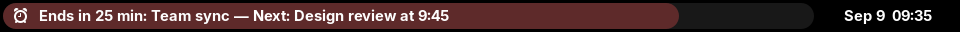

# Next Up 2

A GNOME Shell extension that shows your next calendar event in the status bar.
This Nexus Labs fork builds on [Next Up 2](https://github.com/nanolookc/next-up-2)
and its unmerged [UI overhaul](https://github.com/nanolookc/next-up-2/pull/4).

## See your next meeting getting closer

A colored progress bar fills behind the event text during the final hour before
your next meeting. A glance tells you how much time you have left, while the
clock stays centered and the text keeps GNOME's native theme color.

**Green — time to focus.** With 43 minutes to go, the bar is just getting started.
Green covers 31–60 minutes remaining with the default settings.


**Yellow — wrap things up.** At 20 minutes, the bar is two-thirds full.
Yellow covers 11–30 minutes remaining.


**Red — almost time.** With 5 minutes left, the bar is nearly full.
Red covers the final 10 minutes.



### Already in a meeting? Keep the next one in sight

It's **9:35**: **Team sync** still has **25 minutes** left, but **Design review**
starts at **9:45 — in 10 minutes**. Both events stay visible, and the red progress
bar counts down to the next meeting's start, even though the current meeting
will still be running.



These are actual GNOME 50 captures from a nested development session using
sample events and the default colors, cropped to just the event bar and clock.

## Features

- Supports GNOME 48, 49, 50
- Shows current event in indicator text (optional)
- **Visual Layouts:** Choose between Default and Minimal (short text) styles to save panel space.
- **Centered Clock Layout:** The event indicator fills the space between the workspace control and GNOME's independently centered clock.
- **Bounded Countdown Progress:** A full-height, pill-shaped track sits behind the event widget during the final hour before the next event starts, or before the current event ends. It fills from empty at 60 minutes to full at the target time, using green through 31 minutes, yellow through 11 minutes, and red for the final 10 minutes.
- **Theme-safe Text:** Only the progress bar is colored, so the indicator text keeps GNOME's native light or dark theme color.
- **Stable Hover Geometry:** Hover adds GNOME's translucent highlight without changing or revealing different pill bounds.
- **Early Completion:** Use the drop-down action menu to mark an ongoing event as complete and dismiss it from the top bar.
- **Keyword Filtering:** Automatically hide events containing specific user-defined keywords.
- **Dynamic Sizing:** The indicator follows the available monitor width and gracefully truncates long event text.

Tested on GNOME 49 and 50.

## Installation

The upstream release is available from [extensions.gnome.org](https://extensions.gnome.org/extension/9194/next-up-2/).
The Nexus Labs variant is intended to be installed from a pinned source revision,
such as through the accompanying NixOS configuration.

## Build

To create a publishable extension bundle, run:

```bash
./scripts/build-zip.sh
```

This uses `gnome-extensions pack`, which includes the runtime files for the extension and automatically picks up `schemas/`. Development-only files like `screenshots/` are not added to the ZIP.

## Visual development

GNOME Shell caches loaded JavaScript modules, so disabling and enabling an
extension is not a reliable reload mechanism. Run the extension in GNOME 49+
as a nested development session instead:

```bash
./scripts/preview.sh 43
```

The command stages the working tree in an isolated data directory, injects a
meeting at the requested number of minutes, launches `gnome-shell --devkit`,
captures the rendered desktop to `dist/preview-43-minutes.png`, and closes the
nested shell. Set `NEXT_UP_PREVIEW_HOLD=true` to leave the preview window open
after taking the screenshot. The development calendar hook is inactive unless
`NEXT_UP_PREVIEW_MINUTES` is explicitly set. The bundled compiled schema is
enough for visual work; install `glib-compile-schemas` before changing schema
keys or defaults.

## References

- https://gitlab.gnome.org/GNOME/gnome-shell/-/blob/main/js/ui/calendar.js
- https://extensions.gnome.org/extension/4448/next-meeting/
- https://github.com/corecoding/Vitals

- [Party popper icon](https://www.flaticon.com/free-icon/party-popper_6335608) by [Ayub Irawan](https://www.flaticon.com/authors/ayub-irawan)
